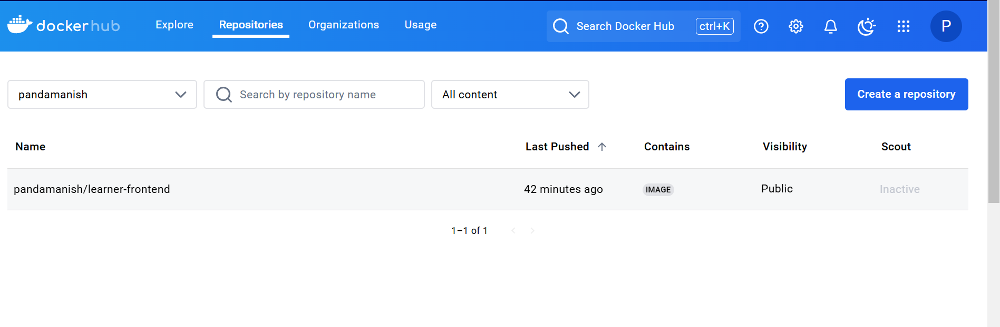
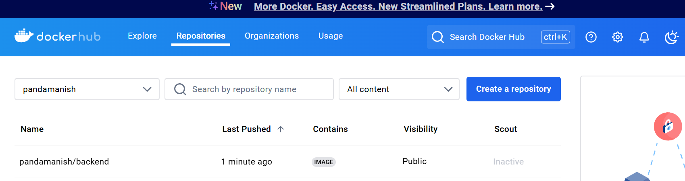
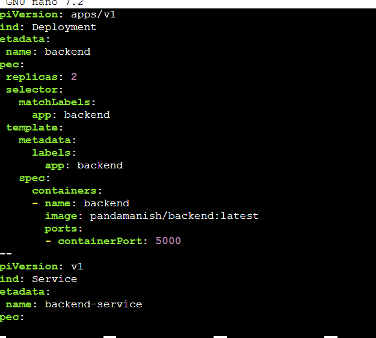
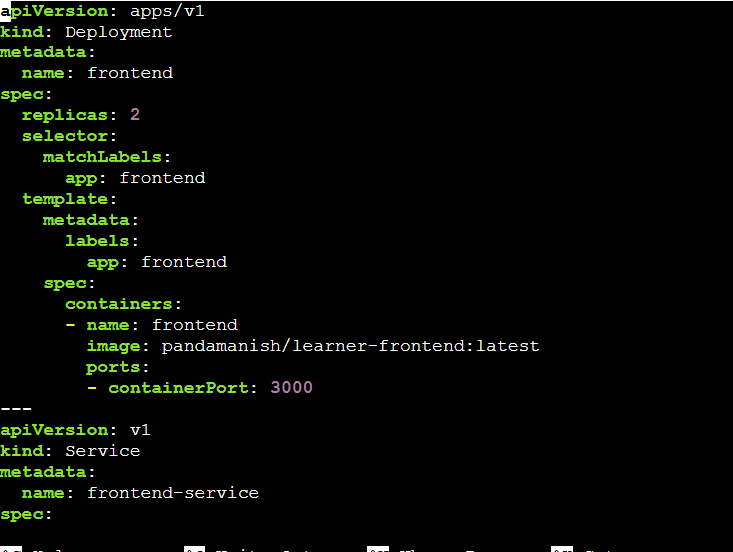
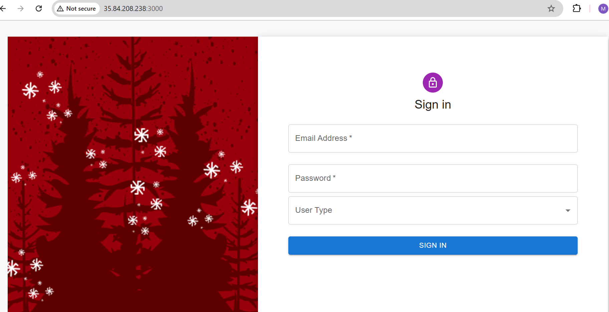
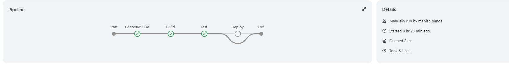

#  MERN Stack Application Deployment

# Overview
This project demonstrates the deployment of a MERN stack application (Frontend and Backend) on AWS EC2 instances using Minikube for Kubernetes and Jenkins for CI/CD automation. The application components are containerized using Docker and deployed in a Kubernetes cluster managed by Minikube. The pipeline is automated using Jenkins for seamless building, pushing, and deployment.

# Features
- Automated CI/CD pipeline using Jenkins.
- Deployment of frontend and backend components in Kubernetes with Helm charts.
- Scalable and modular architecture for modern web applications.
- Secure deployment on AWS EC2 instances.

# Prerequisites
AWS EC2 instances (t3.medium or higher) with Linux OS (Ubuntu 20.04 or later).
Docker installed and configured.
Minikube installed for Kubernetes cluster management.
Jenkins installed and accessible via port 8080.
MongoDB running and configured for the backend.

# Architecture
1. **Frontend**: React-based application.
2. **Backend**: Node.js with Express.
3. **Database**: MongoDB

Deployment Steps
1. Set Up EC2 Instances
Created AWS EC2 instances with t3.medium specifications.
Ran the following command to update the system:
```
sudo apt update
```
3. Install Docker
Installed Docker on EC2 instances:
```sudo apt-get install -y docker.io
docker --version
```

3. Cloned the Application Repositories
Cloned the provided repositories to fetch the frontend and backend codebases:
```
git clone https://github.com/UnpredictablePrashant/learnerReportCS_frontend.git
git clone https://github.com/UnpredictablePrashant/learnerReportCS_backend.git
```
4. Built and Run Docker Images
  a.) Frontend:
  Navigated to the frontend directory:
  ```
  cd learnerReportCS_frontend
  ```
  Updated the Dockerfile:
  Replace node:16 with node:18 due to version compatibility issues.

  Built the Docker image:
  ```
  docker build -t learner-frontend:latest .
  ```
  b.) Backend:
  Navigated to the backend directory:
  ```
  cd ../learnerReportCS_backend
  ```  
  Update the Dockerfile:
  Replace node:16 with node:18.
  Update the config.env file:
  Ensure the correct MongoDB URI is provided.
  Build the Docker image:
  ```
  docker build -t backend:latest 
  ```
  
Run the Docker Containers:
Run the frontend container:
```
docker run -d -p 3000:3000 learner-frontend:latest
```
Run the backend container:
```
docker run -d -p 5000:5000 backend:latest
```

5. Push Docker Images to Docker Hub
Log in to Docker Hub:
```
sudo docker login
```
Tag and push the images:
Frontend:
```docker tag learner-frontend:latest pandamanish/learner-frontend:latest
docker push pandamanish/learner-frontend:latest
```


Backend:
```docker tag backend:latest pandamanish/backend:latest
docker push pandamanish/backend:latest
```

6. Installed Minikube if you its not isntalled in you system
Download and install Minikube:
```
curl -LO https://storage.googleapis.com/minikube/releases/latest/minikube-linux-amd64
sudo install minikube-linux-amd64 /usr/local/bin/minikube
```
Start Minikube:
```
minikube start --driver=docker
```
Configured Docker to use Minikube’s environment:
```
eval $(minikube docker-env)
```
7. Deployed Using Kubernetes
    Prepared Deployment Files:
    a.Created frontend-deployment.yaml and backend-deployment.yaml files with appropriate configurations.
    b.Ensured the correct Docker image name is specified.
   
    c.Maintain proper indentation to avoid deployment errors.
   
   

Apply the Deployment Files:
Apply the frontend deployment:
```
kubectl apply -f frontend-deployment.yaml
```
Apply the backend deployment:
```
kubectl apply -f backend-deployment.yaml
```
Verify Deployment:
Check the running pods:
```
kubectl get pods
```
Check the services:
```
kubectl get services
```
Access the Applications:
Get the Minikube IP:
```
minikube ip
```
Used that Minikube IP with the NodePorts which i had mentioned in my service part of the manifest file to access the applications:
Frontend: 

Backend: http://192.168.49.2:30081

8. Createed and Deployed Helm Charts
Frontend:
Created a Helm chart:
```
helm create frontend
```
created the values.yaml and Charts.yaml file and mkdir templates folder and created (deployment.yaml, service.yaml) with values from frontend-deployment.yaml.

Installed the frontend Helm chart:
```
helm install frontend ./frontend
```

Backend:
Created a Helm chart:
```
helm create backend
```
Updated the values.yaml and templates (deployment.yaml, service.yaml) with values from backend-deployment.yaml.

Install the backend Helm chart:

```
helm install backend ./backend
```
9. Set Up Jenkins for CI/CD
a. Created a EC2 Instance Created a EC2 instance for hosting Jenkins web through EC2.
Installed Jenkins on AWS EC2 Updated and installed Java, Jenkins, and Git on EC2 instance:
For configuring we followed these below steps:
Updated the package list and install Java
```
sudo apt update sudo apt install -y openjdk-11-jdk
```
Add Jenkins repository and key
```
wget -q -O - https://pkg.jenkins.io/debian/jenkins.io.key | sudo apt-key add - sudo sh -c 'echo deb http://pkg.jenkins.io/debian-stable binary/ > /etc/apt/sources.list.d/jenkins.list'
```

Install Jenkins and Git
```
sudo apt update sudo apt install -y jenkins git
wget -q -O - https://pkg.jenkins.io/debian-stable/jenkins.io.key | sudo apt-key add -
sudo sh -c 'echo deb http://pkg.jenkins.io/debian-stable binary/ > /etc/apt/sources.list.d/jenkins.list'
sudo apt update
sudo apt install -y jenkins
sudo systemctl start jenkins
sudo systemctl enable jenkins
```
Access Jenkins on http://44.244.61.68:8080.
Install Plugins:
Install the following plugins:
Pipeline
Docker Pipeline
GitHub
Kubernetes
Added Docker Hub Credentials:
Go to Manage Jenkins → Manage Credentials.
Add a new credential with:
Username:provided Docker Hub username.
Password:provided Docker Hub password.
ID: docker-hub-credentials.
Set Up Jenkinsfile:
Added a Jenkinsfile to each repository (frontend and backend) with Groovy code for CI/CD automation.

Push the Jenkinsfile to GitHub:
```
git add Jenkinsfile
git commit -m "Added Jenkinsfile for CI/CD"
git push origin main
```
Created Jenkins Pipeline Jobs:

Go to Jenkins Dashboard → New Item.
Name the pipeline (frontend-pipeline or backend-pipeline).
Under the Pipeline section:
Select "Pipeline script from SCM."
Choose Git as SCM.
Provide the repository URL and set the script path to Jenkinsfile.
Set the script path to Jenkinsfile.
Save the configuration.
Pipeline Stages would be something like:
Start:
Jenkins fetches the code from the Source Control Management (SCM) system (e.g. GitHub repository),it would pull the learnerReportCS_frontend or learnerReportCS_backend repository.
Build: Jenkins builds the Docker image for the updated code.
Test: Automated tests for the frontend or backend run in this stage.
Deploy:This stage deploys the updated Docker image to the Kubernetes cluster.
End:Marks the successful completion of the pipeline.

Cicking Build Now to trigger the pipeline. 



